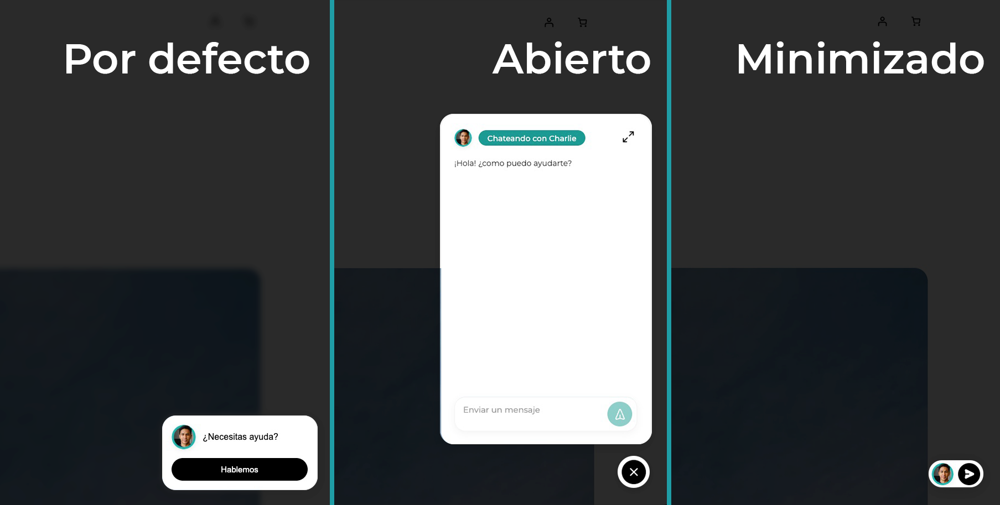
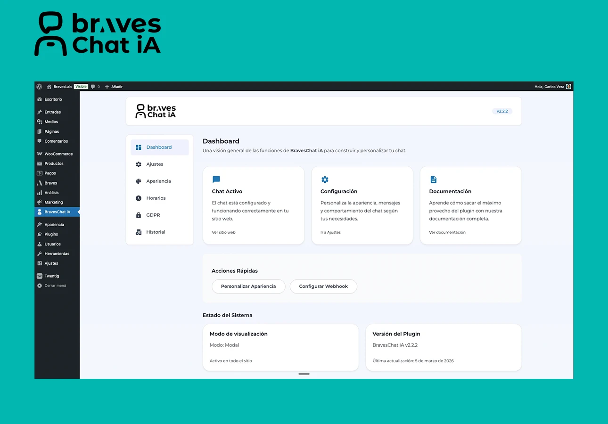
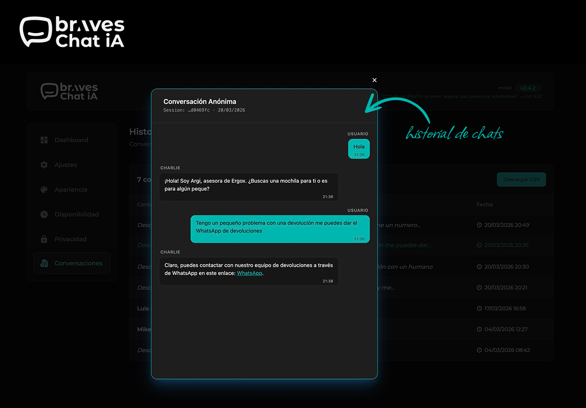
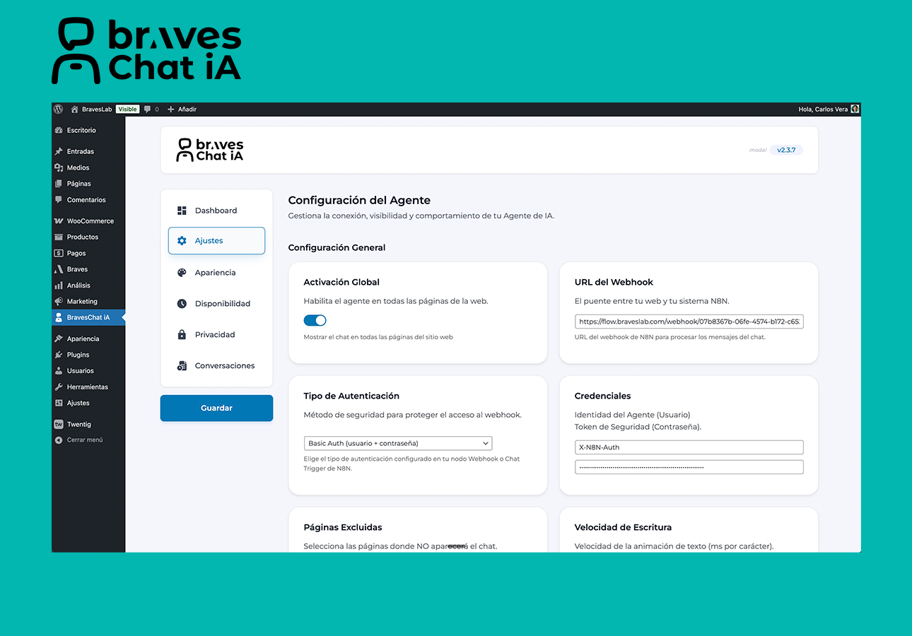

# BravesChat


> Conecta tu WordPress con agentes de IA en N8N.

BravesChat es un plugin de chat para WordPress con integración directa a **N8N**. Configuras el webhook, eliges el diseño y el chat queda listo para producción — sin tocar código.

**Versión actual**: 2.4.2 · [Ver changelog](CHANGELOG.md) · [Repositorio](https://github.com/Carlos-Vera/braveschat)

---

## Screenshots


*El chat en acción — modal flotante integrado en tu web.*


*Personaliza modo de visualización, skin, colores e imagen de burbuja desde el panel.*


*Abre cualquier sesión y lee el hilo completo con burbujas de chat, sin salir de WordPress.*


*Conecta tu webhook de N8N, elige el método de autenticación y configura el comportamiento del chat.*

---

## ¿Por qué BravesChat?

### Seguridad real con N8N
- **Token server-side**: El token de autenticación de N8N nunca llega al navegador. Cada mensaje pasa por WordPress, que añade las credenciales en el servidor antes de reenviar la petición.
- **Tres métodos de autenticación**: Cabecera personalizada (`X-N8N-Auth`), Basic Auth o sin autenticación.
- **Fingerprinting sin datos personales**: Identificación única de sesión mediante hash SHA-256, sin nombre, email ni IP.

### Experiencia de usuario cuidada
- **Dos modos**: Modal flotante o pantalla completa — según cómo quieras integrar el chat en tu web.
- **Skins**: Diseño "Default" y "Braves" con header transparente y avatares.
- **Markdown**: Los mensajes del agente soportan negritas, listas, enlaces y más.
- **Ritmo de escritura**: Controla la velocidad del efecto de escritura para una experiencia más natural.
- **Tipografía Montserrat**: Cargada localmente, sin conexiones externas.

### Historial de conversaciones
- Ves todas las sesiones que tu agente ha tenido con tus visitantes.
- Abres cualquier sesión y lees el hilo completo con burbujas de chat.
- Exportas a CSV con un clic.

### Panel de administración
- Interfaz limpia inspirada en el diseño Bentō.
- Editor visual TinyMCE para mensajes GDPR y mensajes fuera de horario.
- Configuración centralizada — un solo panel para el modal y la versión pantalla completa.

---

## Nuestra promesa

**BravesChat es gratuito y lo seguirá siendo.** Conectar WordPress con un agente de N8N con seguridad y un diseño cuidado no debería costar nada — y eso no va a cambiar.

En algún momento habrá un add-on de pago con funcionalidades avanzadas para quien quiera ir más lejos. El plugin base seguirá siendo 100% libre, sin límites artificiales ni funciones bloqueadas.

---

## Requisitos

- WordPress 5.8+
- PHP 7.4+
- Un flujo activo en N8N con webhook configurado

---

## Instalación

### Desde WordPress.org *(en revisión)*
1. Ve a **Plugins → Añadir nuevo** en tu WordPress.
2. Busca **BravesChat**.
3. Instala y activa.

### Desde el archivo ZIP
1. Descarga el ZIP desde la [página de releases](https://github.com/Carlos-Vera/braveschat/releases).
2. Ve a **Plugins → Añadir nuevo → Subir plugin**.
3. Selecciona el ZIP y activa.

### Desde GitHub
```bash
cd wp-content/plugins/
git clone https://github.com/Carlos-Vera/braveschat.git braves-chat
```

---

## Configuración

Tras activar el plugin encontrarás el menú **BravesChat** en el panel de WordPress.

### Ajustes
Parámetros fundamentales del chat:
- **URL del Webhook** — La URL de tu webhook en N8N.
- **Token de autenticación** — Se envía exclusivamente desde el servidor, nunca al navegador.
- **Mostrar en toda la web** — Toggle global.
- **Páginas excluidas** — Páginas donde no mostrar el chat.

### Apariencia
- Título, subtítulo y mensaje de bienvenida.
- Nombre del agente — visible en el historial de conversaciones.
- Posición: inferior derecha / inferior izquierda.
- Modo de visualización: modal o pantalla completa.
- Colores: primario, fondo, texto, burbuja, icono.
- Icono: selección de SVGs o imagen personalizada.
- Skin: Default o Braves.

### Horarios
- Hora de inicio y fin (formato 24h).
- Zona horaria configurable.
- Mensaje automático fuera de horario (con editor visual).

### GDPR
- Banner de consentimiento antes de crear cualquier cookie.
- Mensaje personalizable con editor visual (negritas, listas, enlaces).
- Texto del botón de aceptación configurable.

### Historial
- URL del webhook de consulta en N8N (conectado a tu base de datos).
- API Key de autenticación.
- Tabla de sesiones: Session ID, email, último mensaje, fecha.
- Visor de conversación por sesión.
- Exportación CSV completa.

---

## Bloque de Gutenberg

El bloque **"BravesChat — Pantalla Completa"** muestra el chat embebido en una página concreta.

1. Edita una página en Gutenberg.
2. Añade el bloque buscando **"BravesChat"**.
3. Opcional: personaliza el mensaje de bienvenida específico para esa página.

El bloque lee la configuración global del plugin (webhook, colores, título). No necesitas duplicar ajustes.

---

## Estructura del plugin

```
braves-chat/
├── braves_chat.php                        # Entrada del plugin
├── uninstall.php                          # Limpieza al desinstalar
├── includes/
│   ├── admin/
│   │   ├── class_admin_controller.php     # Controlador del panel de administración
│   │   ├── class_template_helpers.php     # Helpers de renderizado
│   │   ├── components/
│   │   │   ├── class_admin_header.php
│   │   │   ├── class_admin_sidebar.php
│   │   │   └── class_admin_content.php
│   │   └── templates/
│   │       ├── dashboard.php
│   │       ├── settings.php
│   │       ├── appearance.php
│   │       ├── availability.php
│   │       ├── gdpr.php
│   │       ├── history.php
│   │       └── about.php
│   ├── class_ajax_handler.php             # Proxy server-side hacia N8N
│   ├── class_settings.php
│   ├── class_frontend.php
│   ├── class_block.php
│   ├── class_cookie_manager.php
│   └── class_helpers.php
├── assets/
│   ├── css/
│   │   ├── admin/
│   │   ├── braves_chat_block_modal.css
│   │   ├── braves_chat_block_screen.css
│   │   └── braves_gdpr_banner.css
│   ├── js/
│   │   ├── block.js
│   │   ├── braves_chat_block_modal.js
│   │   ├── braves_chat_block_screen.js
│   │   └── braves_fingerprint.js
│   └── media/
├── templates/
│   ├── modal.php
│   └── screen.php
└── CHANGELOG.md
```

---

## Seguridad

- **Token server-side** — El token de N8N nunca se expone al navegador.
- **Sanitización de inputs** — Todos los datos se sanitizan antes de guardarse.
- **Nonces en formularios** — Protección CSRF en todos los formularios.
- **Escapado de salidas** — `esc_html()`, `esc_attr()`, `esc_url()` en toda salida.
- **Verificación de capacidades** — Solo administradores pueden configurar el plugin.
- **Prepared statements** — Prevención de SQL injection con `$wpdb->prepare()`.
- **Fingerprinting privado** — Hash SHA-256 irreversible, sin datos personales.
- **Flags de cookies** — `Secure` (HTTPS) y `SameSite=Lax`.
- **Limpieza al desinstalar** — El plugin no deja rastros en la base de datos.

---

## Sistema de sesiones y fingerprinting

El plugin identifica a cada visitante con un hash SHA-256 generado a partir de características del navegador: user-agent, resolución, zona horaria, idioma, hardware y canvas fingerprint.

Este ID se envía con cada mensaje para mantener el contexto de la conversación en N8N, sin almacenar ningún dato personal.

```json
{
  "chatInput": "Mensaje del usuario",
  "sessionId": "9f12e684d6abd5ef281b2f33cff298d72f337083..."
}
```

Si las cookies están bloqueadas, el sistema usa `localStorage` como fallback automático.

---

## Compatibilidad

| | |
|---|---|
| **WordPress** | 5.8 → 6.9+ |
| **PHP** | 7.4, 8.0, 8.1, 8.2, 8.3 |
| **Navegadores** | Chrome 90+, Firefox 88+, Safari 14+, Edge 90+ |
| **Móvil** | iOS Safari, Chrome Mobile, Samsung Internet |
| **Temas** | Cualquier tema compatible con WordPress 5.8+ |
| **Page builders** | Elementor, Beaver Builder, Divi |
| **Multisite** | Compatible |

---

## FAQ

**¿Necesito configuración técnica avanzada?**
No. Solo necesitas la URL del webhook de N8N. El resto tiene valores por defecto sensatos.

**¿El token de N8N es seguro?**
Sí. Desde v2.3.0 el token viaja exclusivamente en el servidor. Los visitantes de tu web no pueden acceder a él.

**¿Es compatible con GDPR?**
Sí. El banner de consentimiento bloquea la creación de cookies hasta que el usuario acepta explícitamente.

**¿Puedo usarlo en varias páginas con configuraciones distintas?**
El bloque de Gutenberg permite personalizar el mensaje de bienvenida por página. El resto de ajustes se heredan del panel global.

**¿Qué pasa si el webhook de N8N está caído?**
El chat muestra un mensaje de error al usuario. Recomendable monitorear el flujo en N8N.

**¿Afecta al rendimiento del sitio?**
No. Los assets solo se cargan cuando el chat está activo y están optimizados para impacto mínimo.

---

## Solución de problemas

**El chat no aparece**
- Verifica que el toggle "Mostrar en toda la web" esté activo en Ajustes.
- Comprueba que la página no esté en la lista de excluidas.
- Purga la caché del plugin de caché y del navegador.

**Los ajustes no se guardan**
- Confirma que estás logueado como Administrador.
- Recarga la página antes de guardar (refresca los nonces).

**El banner GDPR no aparece**
- Activa "Habilitar Banner GDPR" en la pestaña GDPR.
- Para testear, borra `braves_chat_gdpr_consent` del localStorage del navegador.

**Logs de depuración**
- PHP: `debug.log` de WordPress.
- JavaScript: consola del navegador, prefijo `BravesChat:`.

---

## Soporte

- **Email**: carlos@braveslab.com
- **Web**: [braveslab.com](https://braveslab.com)
- **Issues**: [github.com/Carlos-Vera/braveschat/issues](https://github.com/Carlos-Vera/braveschat/issues)

---

## Licencia

GPL-2.0-or-later — libre para usar, modificar y distribuir.

Copyright (c) 2026 BRAVES LAB LLC

---

*Desarrollado por [Carlos Vera](https://github.com/Carlos-Vera) para [BravesLab](https://braveslab.com) con el favor de nuestro señor JesusCristo*
